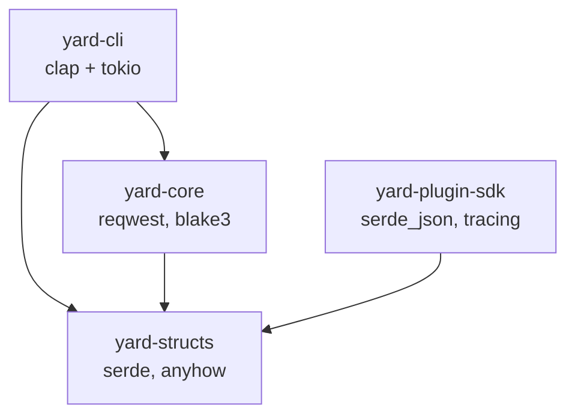
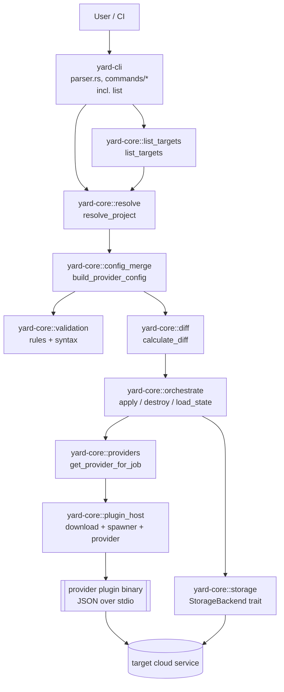

## System overview

YARD is a Rust CLI for data-engineering infrastructure. It consumes a Terragrunt-style hierarchical YAML tree rooted at `yard.yaml`, resolves each job's configuration, tracks per-job deployment state, and delegates all provider-specific work — validation, script generation, deploy, destroy, verify — to **provider plugins**: standalone binaries that yard spawns and talks to over a JSON-over-stdio protocol.

As of v2.0 the yard binary contains no provider implementations. It knows how to
resolve config, diff state, and drive the plugin protocol; everything that
touches a cloud service lives in a plugin. See
[how-to/build-a-plugin.md]() for the plugin side of
the contract.

The workspace is split into four Cargo crates with a strict layering rule: the CLI is a thin wrapper, all business logic lives in `yard-core`, and `yard-structs` holds the serialisable data types shared between the CLI, the core, and the plugin SDK.

## Workspace layout

The workspace is declared in `Cargo.toml` at the repository root:

```toml
[workspace]
resolver = "3"
members = ["yard-cli", "yard-core", "yard-structs", "yard-plugin-sdk"]
```

| Crate | Binary/library | Purpose |
|-------|----------------|---------|
| `yard-cli` (package name `yard`) | `yard` binary | Parses `clap` args, delegates to `yard-core`, prints results. No business logic. v1.3.4 added the `list` subcommand (`yard list targets [--json]`) for CI matrix builders. |
| `yard-core` | library | Plugin host, storage, validation, diff, orchestration, config cascade. v2.0 removed the compiled-in providers, the codegen module and the Airflow DAG module, and added `plugin_host/` (spawner, download, provider). |
| `yard-structs` | library | Shared `serde` types: `ProjectManifest`, `JobDefinition`, `JobState`, `JobDiff`, `StateBackend`, `LockInfo`, `Resource`. v2.0 added `plugin.rs` (the JSON-over-stdio protocol types). Minimal deps (`serde`, `anyhow`, `serde_json`). |
| `yard-plugin-sdk` | library | Published SDK for plugin authors. Wraps the protocol (handshake, request parsing, stdout protection, tracing) behind the `PluginHandler` trait so authors write business logic only. |

## Crate dependency graph



Only `yard-cli` is a top-level consumer. `yard-core` never depends on `yard-cli`, and `yard-structs` depends on nothing inside the workspace — this keeps the shared types small and cheap to depend on. `yard-plugin-sdk` depends only on `yard-structs`, so plugin authors pull in the protocol types without pulling in the whole core.

Note the AWS SDK and templating crates are gone from `yard-core` in v2.0 — those dependencies now live in each provider plugin instead.

## Component diagram — end-to-end plan/apply



Every arrow from `yard-core` to a cloud service now goes through the plugin
boundary. `plugin_host::download` resolves and caches the binary, and
`plugin_host::spawner` runs one child process per operation.

## Data flow — `yard apply`

1. `yard-cli::main` boots a `tokio` runtime and calls `yard::run()` in `yard-cli/src/lib.rs`, which parses the `Cli` struct in `yard-cli/src/parser.rs` and dispatches to `commands/apply.rs`.
2. `commands/apply.rs` calls `yard_core::resolve::resolve_project(base_path)` (`yard-core/src/resolve.rs`). This walks parent directories to find `yard.yaml`, loads each `account.yaml` / `region.yaml` context file, discovers job YAML files, and assembles a `ResolvedProject { manifest, current_state, root_dir }`.
3. Provider-level config is merged with per-job overrides by `yard_core::config_merge::build_provider_config` (`yard-core/src/config_merge.rs`).
4. `yard_core::diff::calculate_diff(&manifest, &state)` in `yard-core/src/diff.rs` generates each job's script by calling the plugin's `codegen` operation, concatenates script + serialised config, hashes with BLAKE3, and emits `JobDiff { Create | Modify { changes } | Delete }` entries. It is `async` in v2.0 because codegen now runs out-of-process.
5. `yard_core::orchestrate::apply` (`yard-core/src/orchestrate.rs`) acquires per-job locks via `Storage::lock_jobs` (atomic with rollback), then for each changed job:
   - Instantiates a `Box<dyn Provider>` via `providers::get_provider_for_job(job_type, &merged_config, plugin_version, plugin_source, &plugin_host_config)`. This downloads and caches the plugin binary if needed, then wraps it in a `PluginProvider`. If the job declares neither `plugin_version` nor `plugin_source`, this is where the v1.x migration error is raised.
   - Calls `provider.deploy(job_name, &artifact, &job_config)` which uploads the generated script to S3 and creates/updates the target resource (Glue job, EMR step, etc.).
   - Writes the resulting `JobState { deployment: Deployment { resources, config_hash, status, applied_at, ... } }` via `Storage::write_job`.
6. Locks are released (rollback-safe) and a summary is returned to `yard-cli`, which formats and prints it.

## Key abstractions

### `Provider` trait — `yard-core/src/providers/mod.rs`

In v2.0 this trait has exactly one implementation: `PluginProvider`
(`yard-core/src/plugin_host/provider.rs`), which forwards each call across the
stdio protocol to a plugin binary. Adding a new provider means shipping a new
plugin binary — no changes to yard core.

```rust
pub trait Provider: Send + Sync {
    fn deploy(&self, job_name: &str, artifact: &str, job_config: &Value)
        -> Pin<Box<dyn Future<Output = Result<Vec<Resource>>> + Send + '_>>;
    fn destroy(&self, job_name: &str, resources: &[Resource])
        -> Pin<Box<dyn Future<Output = Result<()>> + Send + '_>>;
    fn verify_resources(&self, job_name: &str, resources: &[Resource])
        -> Pin<Box<dyn Future<Output = Result<Vec<ResourceStatus>>> + Send + '_>>;

    // v2.0 additions, all defaulted so the trait stays cheap to implement:
    fn validate(&self, job_name: &str, job_config: &Value)
        -> Pin<Box<dyn Future<Output = Result<Vec<ValidationError>>> + Send + '_>>;
    fn codegen(&self, job_name: &str, job_config: &Value)
        -> Pin<Box<dyn Future<Output = Result<Option<String>>> + Send + '_>>;
    fn schema(&self)
        -> Pin<Box<dyn Future<Output = Result<Vec<SchemaField>>> + Send + '_>>;
}
```

`deploy` returns the `Resource`s it created so state can track them. `verify_resources` is used by drift detection to catch out-of-band deletions. `codegen` and `validate` moved here from the deleted core modules, and `schema` drives config-cascade validation.

### `plugin_host` — `yard-core/src/plugin_host/`

- `download.rs` — expands the `plugin_source` URL template (`${name}`, `${version}`, `${os}`, `${arch}`), downloads over HTTPS, caches the binary at `.yard/plugins/{name}-{version}-{arch}-{os}`, and records a SHA-256 in `yard.lock` (trust on first use).
- `spawner.rs` — one child process per operation. Writes the request line to stdin, closes stdin, reads the response line from stdout. Verifies the cached binary's checksum against `yard.lock` before spawning.
- `provider.rs` — `PluginProvider`, the `Provider` impl that maps trait methods onto protocol operations.

The unidirectional flow (write request, close stdin, then read) is deliberate: it avoids the classic stdio deadlock where both sides block waiting on the other.

### `StateBackend` + `Storage` — `yard-core/src/storage.rs`

`StateBackend` (in `yard-structs/src/state.rs`) is a two-variant enum selected by `yard.yaml`:

```rust
pub enum StateBackend {
    Local { path: PathBuf },
    S3    { bucket: String, region: String, key: String },
}
```

`get_storage` (in `yard-core/src/storage.rs`) maps this to a `Storage` enum (`Local(LocalStorage)` / `S3(S3Storage)`). Both backends implement the same surface:

- **Per-job state**: `read_job`, `write_job`, `delete_job`, `list_jobs`. State files are `<job_name>.json` at the backend prefix.
- **Per-DAG state**: `read_dag`, `write_dag`, `delete_dag`, `list_dags`. Retained in v2.0 only so existing `_dag_`-prefixed state files stay readable and are excluded from job listings; core no longer writes new DAG state.
- **Locking**: `lock`, `unlock`, `force_unlock`, `lock_jobs`, `unlock_jobs`. Local uses `O_CREAT | O_EXCL` atomic file creation; S3 uses `PutObject` with `If-None-Match: *`. There is no global lock — each job has its own lock file, enabling concurrent deploys.

### `ProjectManifest` — `yard-structs/src/config.rs`

The in-memory representation of the resolved YAML tree. Holds the project name, `StateBackend`, per-provider defaults (`providers: HashMap<String, Value>`), all discovered jobs (`jobs: HashMap<String, JobDefinition>`), and the root-level `aws:` block (for AssumeRole / session config).

### `JobDefinition` + `JobState` — `yard-structs/src/{config.rs,state.rs}`

`JobDefinition` is what the user wrote in YAML after context inheritance: `job_type` (a `JobType::Plugin(String)` in v2.0), `plugin_version` / `plugin_source`, `sources: Vec<Source>`, `transforms: Vec<Transform>`, `sink: Option<Sink>`, partitioning directives, and an optional `body` / `job_file` escape hatch. `JobState` is what was deployed: `{ job_name, project, deployment: Deployment { config_hash, config, status, applied_at, resources } }`. The BLAKE3 `config_hash` in `Deployment` is compared against a freshly-hashed proposed config during `calculate_diff` to detect changes.

### Script generation — the plugin `codegen` operation

There is no codegen module in v2.0. `yard-core` asks the plugin for a script:
`PluginProvider::codegen` sends a `codegen` request with the job name and merged
config, and the plugin returns the script body (or `None` if the provider needs
no script). Template engines, PySpark rendering and provider-specific dialects
are entirely the plugin's business.

Two things still happen in core:

- A `job_file: path.py` field bypasses the plugin's codegen and uses the
  external script verbatim.
- The returned script is folded into the BLAKE3 config hash, so a change in
  generated output shows up as a `Modify` diff.

See [how-to/build-a-plugin.md]() for the `codegen`
request/response shape.

## Directory structure rationale

### `yard-cli/src/`

- `main.rs` — one-liner that boots `tokio` and calls `yard::run()`.
- `lib.rs` — `run()` parses args and dispatches to `commands::*`.
- `parser.rs` — `clap` `Cli` / `Commands` enum for `init`, `plan`, `apply`, `show`, `validate`, `destroy`, `force-unlock`, `list`.
- `commands/` — one file per subcommand; each is 20–80 lines of "call core, format output."
- `context.rs`, `utils.rs` — terminal color handling (`--no-color`, `--colorblind`, `NO_COLOR` env var).

### `yard-core/src/`

- `resolve.rs` — walks the YAML tree to build a `ResolvedProject`.
- `parsing.rs` — low-level YAML-to-struct parsing helpers (sources, sinks, transforms).
- `config_merge.rs` — layers provider defaults, account/region context, and job overrides into a single merged config blob.
- `providers/` — the `Provider` trait and `get_provider_for_job`, the plugin-only dispatch that raises the v1.x migration error.
- `plugin_host/` — plugin binary download/caching (`download.rs`), process lifecycle and checksum verification (`spawner.rs`), and the `Provider` impl over the protocol (`provider.rs`).
- `storage.rs` — `StateBackend` → `Storage` factory; per-job file I/O and locking for both Local and S3.
- `orchestrate.rs` — top-level `apply` / `destroy_all` / `destroy_job` / `force_unlock` / `init_state_backend` / `load_state` / `verify_deployed_resources`.
- `diff.rs` — hash-and-compare between `ProjectManifest` and `ProjectState`.
- `validation/` — structural schema validation (`rules.rs`), optionally refined by the plugin's `schema()` response; `syntax.rs` retains the Python syntax-check helper.
- `list_targets.rs` — `yard list targets [--json]` implementation. Manifest-driven enumeration from `manifest.jobs`; state files are NOT consulted, so un-applied targets appear in the output. Used by CI/CD matrix builders to fan out `apply --target` with per-account OIDC roles.
- `show.rs` — implements `yard show <job>`.
- `utils.rs` — `calculate_hash` (BLAKE3) and misc helpers.

### `yard-structs/src/`

- `config.rs` — `ProjectManifest`, `JobDefinition`, `Source`, `Sink`, `Transform`, `AirflowSection`, `YARDContext`.
- `state.rs` — `StateBackend`, `JobState`, `DagState`, `Deployment`, `DagDeployment`, `Resource`, `ResourceStatus`, `LockInfo`, `AwsCredentialConfig` (per-field cascade for `airflow.aws:` since v1.6 `691a950`).
- `trigger.rs` (v1.6) — typed `Trigger` enum (5 source variants — `schedule`, `s3`, `dataset`, `sqs`, `api` — plus composite `all`/`any`). Hand-rolled `Serialize` / `Deserialize` impls for actionable typo errors and HASH-02 canonical-JSON ordering of composite lists. `#[serde(deny_unknown_fields)]` on every leaf trigger struct (T-28-01-05 mitigation).
- `error.rs` — workspace-shared error type referenced by orchestration and codegen surfaces.
- `diff.rs` — `DiffType { Create, Modify { changes }, Delete }`, `JobDiff`, `DagDiff`.
- `validation.rs` — `ValidationError { field, message }`.

### State backend options

Two backends ship today, selected by the `state:` block in `yard.yaml`:

| Backend | When to use | State file shape |
|---------|-------------|------------------|
| `Local { path }` | Single-developer prototyping | `<path>/<job>.json` and `<path>/<job>.json.lock` |
| `S3 { bucket, region, key }` | Team deploys, CI, production | `s3://<bucket>/<key>/<job>.json` and `.lock`; `If-None-Match: *` for atomic lock acquisition |

DAG state is stored alongside job state with a `_dag_` filename prefix in both backends, so `list_jobs` and `list_dags` can walk the same directory/prefix without collision.

### Why this split?

- **`yard-structs` is tiny on purpose** — only `serde`, `anyhow`, `serde_json`. The CLI, the core, and the plugin SDK all link against it, so keeping it free of AWS SDKs and framework code keeps compile times reasonable for plugin authors too.
- **`yard-core` is a library, not an application** — it never prints to stdout, never parses args, never binds sockets. `yard-cli` is a thin driver over it, so any future consumer gets identical behaviour.
- **No global state lock** — every job has its own state file and its own lock. A plan/apply pipeline for `jobs/orders.yaml` cannot block a concurrent pipeline for `jobs/customers.yaml`, which is essential for concurrent CI pipelines.

---

<small>This page is generated from [the repository](https://github.com/sean-mca/yard/blob/main/docs/explanation/architecture.md). Edit it there.</small>
